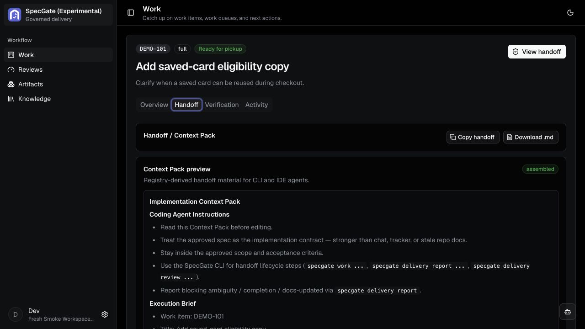

<p align="center">
  
</p>

<h1 align="center">SpecGate</h1>

<p align="center">
  <strong>Give coding agents the right spec—and know what they delivered.</strong><br/>
  Approve one version, hand off clear context, and review the evidence that comes back.
</p>

<p align="center">
  <a href="https://thanhtung2693.github.io/specgate/"></a>
  <a href="https://github.com/thanhtung2693/specgate/actions/workflows/release-readiness.yml"></a>
  <a href="LICENSE"></a>
</p>

SpecGate is a local-first governance layer for AI-assisted software delivery.
It remembers exactly which version your team approved, gives the coding agent a
focused Context Pack, and checks the returned evidence against your acceptance
criteria.

Keep writing specs where you already work—OpenSpec, Spec Kit, Superpowers,
Markdown, or another tool. SpecGate does not take over authoring. It manages the
handoff from approved intent to implementation and keeps the resulting evidence
and review history together.

> **Status: v0.1 early release.** SpecGate is for cautious local evaluation and trusted
> self-hosted trials. Start with the CLI. Use the web UI when you want to inspect
> artifacts, review work, manage settings, or use governance chat. APIs, UI
> details, and experimental features may still change.

## Why SpecGate?

Spec-driven tools help generate strong plans and specs. The hard part comes
after: knowing which version was approved, whether an agent completed every
acceptance criterion, and whether delivery evidence still matches the spec after
changes.

SpecGate keeps that handoff outside your code repository. It records the
approved artifact version, gives the coding agent a focused Context Pack, and
makes delivery reviewable against the original acceptance criteria.

## Quickstart

You do not need Docker, a source checkout, Go, Node.js, Python, or a model API
key for the default Local CLI workflow.

```bash
curl -fsSL https://raw.githubusercontent.com/thanhtung2693/specgate/main/scripts/install-cli.sh | sh
specgate init
```

Interactive `specgate init` starts with **Local CLI**: SQLite state on this
machine, no Docker, server, browser, or TCP service. It creates a local user
and workspace, then prints the matching IDE-plugin command. Choose **Full appliance** in
the prompt, or run `specgate init --mode full`, when you need the browser,
governance chat, Knowledge, integrations, or shared server-backed workspaces.

If you skipped IDE setup during init:

```bash
specgate plugins install --agent codex --project-local
specgate doctor
specgate plugins doctor --agent codex --project-local
specgate status
```

Restart selected IDEs after plugin install so new skills, hooks, and rules load.

Continue with the [full quickstart](docs/using-specgate/quickstart.md).

## How a work item moves through SpecGate

```text
publish artifact
-> resolve governance
-> run readiness checks
-> approve the exact artifact version
-> hand a Context Pack to the coding agent
-> submit delivery evidence
-> review delivery against acceptance criteria
-> reconcile or complete
```

This workflow works without a server-side model. Add one in Full mode when you
want independent readiness judgment, model-backed delivery review, governance
chat, or platform-drafted acceptance criteria for explicit quick-route work.

## What you can do

- Versioned artifact publishing and approval.
- Context Packs for coding agents.
- Local users, shared workspaces, and per-project workspace binding.
- CLI-first workflow for humans and IDE agents.
- IDE plugin files for Codex, Claude Code, and Cursor.
- Automatic governance policy, readiness gates, delivery evidence, and delivery review.
- Deterministic check bindings for acceptance criteria with `@check:<name>`.
- Workspace-scoped Knowledge and integration foundations.
- `specgate stats` for first-pass yield, caught gaps, rework depth, and cycle
  time from real run data.

SpecGate does not replace your authoring tool, issue tracker, coding IDE, pull
request review, or CI. It records the governed handoff and delivery review
across those systems.

## Web UI (experimental)

Most implementation work stays in your IDE. Open the web UI when you need to
inspect the governed handoff: artifact context, gates, Context Packs, delivery
reviews, governance conversations, or workspace settings.



## Repository layout

| Module | Stack | Responsibility |
|---|---|---|
| `app/doc-registry` | Go | Artifacts, versions, policy, evidence, integrations, and REST |
| `app/agents` | Python / LangGraph | Governance-ops chat, model-judged gates, delivery review, and reconciliation |
| `app/ui` | Vite / React | Review, artifact inspection, governance chat, settings, and operations |
| `app/cli` | Go / Cobra | Human and coding-agent interface to SpecGate |

SpecGate expects a trusted network. Do not expose the general Doc Registry HTTP
surface or web UI directly to the public internet.

## Documentation

- [Documentation home](docs/README.md)
- **Use SpecGate:** [User documentation](docs/using-specgate/README.md),
  [Quickstart](docs/using-specgate/quickstart.md),
  [coding-agent workflow](docs/using-specgate/guides/coding-agent-workflow.md),
  and [CLI reference](docs/using-specgate/reference/cli.md).
- **Contribute:** [Contributor documentation](docs/contributing/README.md),
  [setup](docs/contributing/setup.md),
  [architecture](docs/contributing/architecture.md), and
  [contracts](docs/contributing/contracts.md).
- [Contributing](CONTRIBUTING.md)
- [Security](SECURITY.md)

## Roadmap

- Continue hardening governance chat around gate failures, artifact context, and
  thread continuity.
- Promote the browser UI after more team use and workflow polish.

Missing something? [Open an issue](https://github.com/thanhtung2693/specgate/issues).

## License

Apache-2.0 - see [LICENSE](LICENSE).
